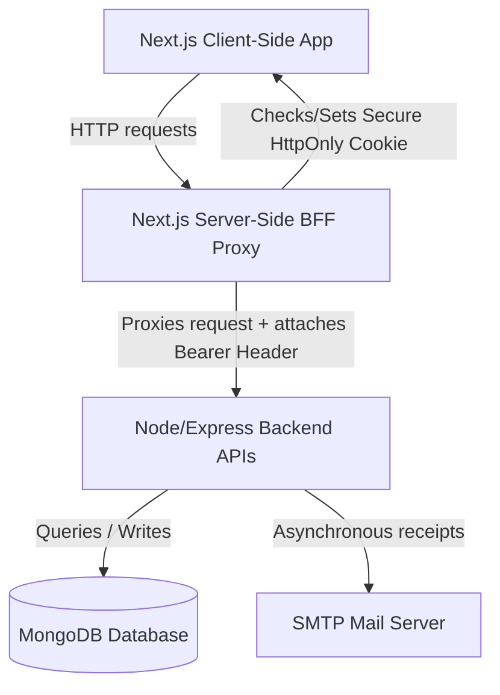

# Campus Canteen Automation System

A production-ready, industry-grade school and college canteen automation system built with Node.js, Express, Next.js (App Router), TypeScript, and MongoDB. This repository represents a full-stack, secure, role-based food ordering platform designed for high performance and strict data integrity.

---

## 🏗️ System Architecture

The project is structured under a **Backend-For-Frontend (BFF)** proxy architecture to secure session tokens against client-side script read attacks (XSS).



---

## 🔒 Security Audit Sheet

| Threat Area | Risk | Implemented Defense Mechanism |
| :--- | :--- | :--- |
| **Session Hijacking** | XSS stealing JWT tokens from browser storage | JWT is stored in a server-set, secure, **`HttpOnly`**, **`Secure`**, and **`SameSite=Lax`** cookie. Client-side JS cannot access it. |
| **Credential Theft** | Plaintext database leak or weak password cracking | Passwords are automatically salted and hashed using **Bcrypt with 12 rounds** inside database hooks. Password strength constraints require minimum 8 characters with at least 1 number and 1 letter. |
| **Privilege Escalation** | Manipulating requests to self-promote to Admin | Registration routes strictly enforce `role: 'student'` on document compilation. Admin status can only be provisioned directly via DB. |
| **NoSQL Injection** | Payload overrides querying unauthorized tables | Sanitized parameterized document queries via Mongoose ODM instead of compile string structures. |
| **Denial of Service (DoS)**| Payload overflow crashing server resources | Inbound Express body parses are restricted to a **10KB limit** to fail fast on large request attacks. |
| **Email XSS Injection** | Malicious script execution in receipt email client | All dynamic email values (Order ID, Student Name, Item names) are sanitised via a custom **HTML escaping helper** before compilation. |
| **BOLA / Authorization** | Accessing other students' orders | Ownership is validated close to database access by checking `student: req.user._id` for all student endpoints. |

---

## 📡 REST API Documentation

### Authentication Routes (`/api/auth`)
*   `POST /register` - Registers a student account. (Requires: `name`, `email`, `password`)
*   `POST /login` - User login. Sets the secure cookie. (Requires: `email`, `password`)
*   `POST /logout` - User logout. Clears the cookie.
*   `GET /me` - Fetches authenticated profile details (requires token).

### Menu Routes (`/api/menu`)
*   `GET /` - Public menu browsing. Query parameters: `category` (Snacks/Meals/Drinks), `isVeg` (true/false), `search` (text search).
*   `POST /` - [Admin Only] Creates a menu item.
*   `PUT /:id` - [Admin Only] Updates a menu item.
*   `DELETE /:id` - [Admin Only] Deletes a menu item.

### Order Routes (`/api/orders`)
*   `POST /` - [Student Only] Places an order. Checks stock, atomically decrements menu stock, updates user spending records, and triggers an email receipt asynchronously.
*   `GET /my-orders` - [Student Only] Views order history.
*   `GET /` - [Admin Only] Views all live orders.
*   `PATCH /:id/status` - [Admin Only] Updates order status (`Pending` -> `Preparing` -> `Ready for Pickup` -> `Completed`).

### Admin Statistics (`/api/admin`)
*   `GET /analytics` - [Admin Only] Fetches sales revenue totals, active order queues count, and student registrations.
*   `GET /students` - [Admin Only] Lists registered student accounts and their overall spending history.

---

## 🛠️ Developer Setup Guide

### Prerequisites
*   Node.js (v18+)
*   MongoDB (Running locally on default port `27017`)

### Installation & Run

1.  **Clone the workspace** and navigate to the project directory:
    ```bash
    cd canteen
    ```
2.  **Install all dependencies** across workspace roots:
    ```bash
    npm run install-all
    ```
3.  **Configure environments**:
    *   Review backend configuration in [backend/.env](file:///Users/saurabhkhanka/Desktop/personal/canteen/backend/.env) (pre-seeded with dev secrets).
    *   Review frontend configuration in [frontend/.env](file:///Users/saurabhkhanka/Desktop/personal/canteen/frontend/.env).
4.  **Seed the dev admin account**:
    ```bash
    npm run dev --prefix backend # Ensure DB is loaded, then:
    # (Or compile and run backend/src/seed-admin.ts)
    ```
5.  **Start concurrent dev servers**:
    ```bash
    npm run dev
    ```
    This boots the frontend at `http://localhost:3000` and the backend at `http://localhost:5000`.

---

## 🚀 Production Deployment Blueprints

### 1. Back-End Deployment (Render)
1.  Sign up on **Render** and click **New Web Service**.
2.  Connect your GitHub repository, selecting the root directory as `backend`.
3.  Set settings:
    *   **Runtime**: `Node`
    *   **Build Command**: `npm install && npm run build`
    *   **Start Command**: `npm start`
4.  Add environment variables in the Render settings panel:
    *   `MONGODB_URI` - MongoDB Atlas connection string.
    *   `JWT_SECRET` - A long cryptographically secure random string.
    *   `PORT` - `5000`
    *   `HOST` - `0.0.0.0` (for public bind on Render proxy)
    *   `NODE_ENV` - `production`
    *   `ALLOWED_ORIGINS` - `https://your-frontend-domain.vercel.app`
    *   `SMTP_HOST`, `SMTP_PORT`, `SMTP_USER`, `SMTP_PASS`, `SMTP_FROM` - SMTP mail settings.

### 2. Front-End Deployment (Vercel)
1.  Import your repository into **Vercel** and select the `frontend` folder as the root directory.
2.  Select **Next.js** framework preset.
3.  Set environment variables:
    *   `BACKEND_URL` - The Render service URL (e.g. `https://canteen-backend.onrender.com`).
4.  Click **Deploy**. Next.js server-side route handlers will dynamically proxy requests to Render securely.
